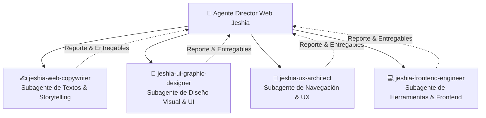

# Jeshia — Sistema Jerárquico de Creación Web

Este espacio de trabajo cuenta con una estructura jerárquica de agentes de inteligencia artificial para el diseño, desarrollo y refinamiento de la plataforma digital de **Jeshia (Home & Aromas)**:

---

## 👑 1. Agente Director Principal (Main Agent)

### 👑 `jeshia-web-director` (Director Creativo & Técnico Web)
* **Rol Principal:** Es el líder de proyecto y orquestador general al que se reportan todos los subagentes. Analiza los requerimientos del usuario, desglosa las tareas, delega a los subagentes especializados y realiza el control de calidad final (*Botanical Luxury QA*).
* **Skill:** [`.agents/skills/jeshia-web-director/SKILL.md`](file:///.agents/skills/jeshia-web-director/SKILL.md)

---

## 🏛️ 2. Subagentes Especializados (Reportan al Director)

### ✍️ Subagente 1: `jeshia-web-copywriter` (Textos Web, Microcopy & Storytelling)
* **Especialidad:** Titulares de impacto, microcopys de botones/inputs, descripciones sensoriales del catálogo, pirámides olfativas de las 13 fragancias, textos del Quiz de aromas, modales y mensajes formateados de checkout para WhatsApp.
* **Skill:** [`.agents/skills/jeshia-web-copywriter/SKILL.md`](file:///.agents/skills/jeshia-web-copywriter/SKILL.md)
* **Regla de voz:** [`.agents/rules/jeshia-brand-voice.md`](file:///.agents/rules/jeshia-brand-voice.md)

### 🎨 Subagente 2: `jeshia-ui-graphic-designer` (Diseño Gráfico Web, UI & Colorimetría)
* **Especialidad:** Dirección de arte digital, tokens de diseño CSS, armonía de contrastes, diseño de tarjetas de producto, banners, diagramas SVG de pirámides olfativas, iconografía botánica, Dark Mode Obsidian y generación de assets fotográficos con IA.
* **Skill:** [`.agents/skills/jeshia-ui-graphic-designer/SKILL.md`](file:///.agents/skills/jeshia-ui-graphic-designer/SKILL.md)
* **Regla de diseño:** [`.agents/rules/jeshia-design-system.md`](file:///.agents/rules/jeshia-design-system.md)

### 🧭 Subagente 3: `jeshia-ux-architect` (Experiencia de Navegación, UX & CRO)
* **Especialidad:** Arquitectura de información, flujos de usuario (User Journeys), usabilidad móvil táctil (Thumb Zone, scroll horizontal en tabs sin desborde), diseño responsive (375px a 1440px), accesibilidad WCAG AA y optimización de conversión (CRO) hacia WhatsApp.
* **Skill:** [`.agents/skills/jeshia-ux-architect/SKILL.md`](file:///.agents/skills/jeshia-ux-architect/SKILL.md)

### 💻 Subagente 4: `jeshia-frontend-engineer` (Herramientas Interactivas & Frontend)
* **Especialidad:** Programación y optimización en Vanilla HTML5 / CSS3 / JavaScript (`index.html`, `css/main.css`, `js/main.js`, `js/products.js`). Desarrollo de módulos interactivos: Gift Box Builder (Mix & Match), Mood Wheel (Neuro-Aromaterapia), Simulador de Ambientes, Calculadora Eco-Refill, Calculadora B2B, Carrito Drawer persistente en `localStorage`, checkout WhatsApp y rendimiento 60 FPS.
* **Skill:** [`.agents/skills/jeshia-frontend-engineer/SKILL.md`](file:///.agents/skills/jeshia-frontend-engineer/SKILL.md)

---

## 🌿 3. Mandamientos Maestros Compartidos (Botanical Luxury)
* **5 Líneas Oficiales:** Home Spray 250ml ($12.990), Mikado 50ml ($13.990), Aromatizador 15ml ($5.490), Recarga Eco 250ml ($7.490), Recarga Familiar 500ml ($11.990), Set Ritual ($26.000).
* **13 Fragancias Exclusivas:** Vainilla Coco, Citric, Berries, Coco Nut, Sugar, Chicle, Manzana Canela, Coco Flower, Mokka, Limón, Pino, Lavanda, Frutal Mango.
* **Paleta Maestra:** Terracota (`#C47A47`), Verde Bosque (`#2A4031`), Alabastro (`#FBF8F3`), Obsidiano (`#0C0F0C`), Roble Dorado (`#D4A373`).
